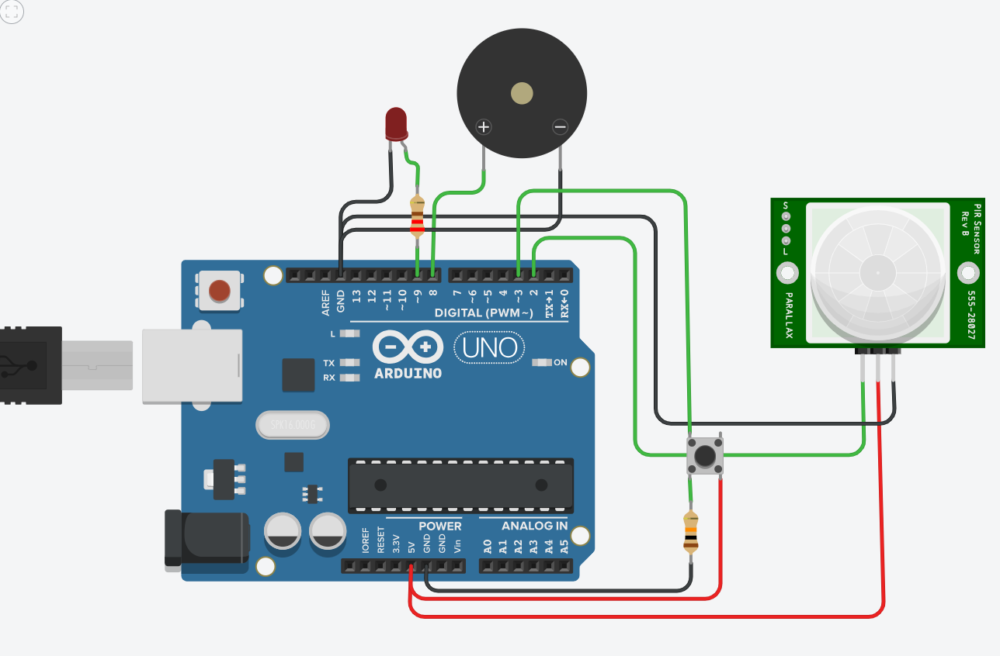

# Motion Alarm System 🚨

A real-time motion detection system built in Arduino (.ino) using:

- PIR motion sensor with hardware interrupt (INT0)
- Pushbutton (INT1) to silence the alarm
- Timer1 configured in CTC mode for periodic UART alerts
- Buzzer and LED as alarm output
- UART communication for logging and remote commands (e.g. `SILENCE`)

## Features

- Hardware-level interrupt handling
- Timer-based periodic UART message (every 4 seconds)
- Remote alarm control via serial input
- Clean and modular code written in **C-style** Arduino

## Run the Project

1. Open `motion_alarm.ino` in Arduino IDE
2. Choose Arduino Uno as your board
3. Upload and open Serial Monitor (9600 baud)
4. Simulate motion and try sending the `SILENCE` command!

## 📐 Circuit Diagram

## 🧰 Components Used

- 1 × Arduino Uno
- 1 × PIR Motion Sensor
- 1 × Pushbutton
- 1 × Buzzer (active)
- 1 × LED (any color)
- 1 × 220Ω Resistor (for LED)
- 1 × 10kΩ Resistor (for pushbutton pull-down)
- Jumper wires

## 🎬 Demo Video
[Watch the demo](https://drive.google.com/file/d/1Wbuk8ar1bGEfH5gAFu7NGFreaZfcMI0J/view?usp=sharing)

